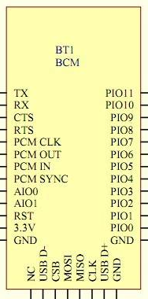

***************************************
On Bluetooth Hardware and Communitation
***************************************

CSR BC417
=========

:download:`download "datasheet" <datasheets/hcbt.pdf>`

where to buy
  - `Deal Extreme <http://www.dealextreme.com/p/wireless-bluetooth-rs232-ttl-transceiver-module-80711>`_  
    ``$ 6.60``
  - `Goodluck Buy <http://www.goodluckbuy.com/serial-bluetooth-rf-transceiver-module-rs232.html>`_
    ``$ 6.77``

the pinout of the board as advertised on `Goodluck Buy <http://www.goodluckbuy.com/serial-bluetooth-rf-transceiver-module-rs232.html>`_

+-----+-------------+
| PIN | function    |
+=====+=============+
| 1   | TX          |
+-----+-------------+
| 2   | RX          |
+-----+-------------+
| 12  | 3.3V        |
+-----+-------------+
| 13  | GND         |
+-----+-------------+
| 21  | GND         |
+-----+-------------+
| 22  | GND         |
+-----+-------------+
| 24  | LED         |
+-----+-------------+
| 34  | programming |
+-----+-------------+

some blogs about it
  - `endasmedia <http://endasmedia.ch/projects/bluetooth_telemetrie.php?start_from=5&ucat=&archive=&subaction=&id=&>`_
    - German
    - different firmwares with different AT command sets
    - two different hardware versions
    - CSR BlueSuite on CD (with BlueFlash for new firmware)
  - `Byron's Blog <http://byron76.blogspot.com/2011/09/one-board-several-firmwares.html>`_
    - PIN-out
      - ``PIN1`` (upper left) : tx
      - ``PIN2`` : rx
      - ``PIN12`` : 3.3V
      - ``PIN13`` : gnd
      - ``PIN24`` : LED working mode indicator (flashing before pairing
        then continuously high)
      - ``PIN26`` : "key" (?)
    - ``AT`` commands : with ``CR``/``LF``, must be sent at once, wait one sec between; can
      be sent when device is not paired; ``pin 34`` must be pulled high for this
      (having ``pin 34`` low or floating sets device into data transmit mode)

      - ``AT+VERSION`` to get software version
      - ``AT+BAUDx`` set baud rate (1 >> 1200, 2 >> 2400, 3 >> 4800, 4 >> 9600 (Default), 5 >> 19200 
        6 >> 38400, 7 >> 57600, 8 >> 115200, 9 >> 230400)
      - ``AT+NAMExxx`` sets name of module
      - ``AT+PINxxxx`` sets pairing password (default ``1234``)
      - ``AT+PN`` sets parity

    - ``HC06`` firmware (a.k.a. Linvor1.5)
      - change baud settings ``1200-1382400``
      - change name (20 characters)
      - set PIN (``1234`` by default)
  - `Zonemike'ls Blog <http://www.zonemikel.com/wordpress/?p=788>`_
  - `A Russian blog <http://microsin.ru/content/view/1284/44/>`_

    - ues BlueFlash_ and parallel connector to program device (parallel 
      pins : 18-25 gnd, 2 CSB, 8 MOSI, 9 clk, 10 MISO, 3.3 V provided by
      separate voltage regulator and CLK/MOSI/CSB converted 5->3.3V)
  
  - `Pial's (We)Blog <http://www.pial.net/post/Using-the-HC-05-Bluetooth-RS232-Serial-module-for-cheap-wireless-communication-with-your-uController.aspx>`_

    - bt specs v2.0+ EDR, 2.4 GHz ISM band, GFSK modulation
    - <4dBm emission power (class II), sensitivity <=-84dBm
    - bluetooth serial port profile, authentication, encryption
    - power supply 3.3V, 50 mA
    - without pullup on ``RXD`` (as recommended by "datasheet")
    - voltage divider CMOS to TTL for ``RXD``
    - has it's own 3.3V LDO voltage regulator (SIP21106DR)
    - connects ``PIN34`` with jumper
    - connects LEDs to ``PIN31`` and ``PIN32``
    - ``10k/0.1u`` reset RC to ensure reset on powerup

  - some more data for "datasheet"

    - power comsumption 30-40 mA during pairing, 8 mA afterwards
    - pads 1x1 mm, 1.5 mm spaced
    - says TTL/CMOS level input/output 
    - factory default for serial communcation : ``9600N81``
    - commands sent without line terminator; should be paused by 1s

.. _BlueFlash: http://depositfiles.com/files/fd0ny5lj0

Bluetooth Communication
=======================

links

  - `Android + Processing + Bluetooth (oscar) <http://webdelcire.com/wordpress/archives/1045>`_
  - `Amarino <http://www.amarino-toolkit.net/index.php/getting-started.html>`_
  - `BlueCove <http://www.bluecove.org/>`_
  - 
